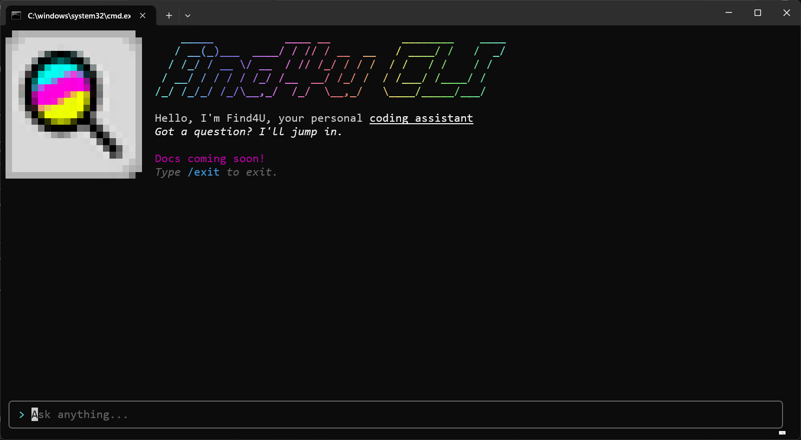

# Find4U CLI

> **EPILEPSY WARNING:** The CLI can flicker. User discretion is advised. I am working to fix this.

[](https://asciinema.org/a/1257517)

The Find4U CLI is your AI coding assistant. Currently, it can participate in conversations and read and write files.

## How can I use it?

To use it, simply run (with Node.js installed):

``` bash
npx find4u-cli
```

If this is your first time running it, it will open the OpenRouter homepage and prompt you for an OpenRouter API key. Create an OpenRouter account and create an API key and enter it. Then you will be able to use the CLI normally. Ask it questions or type `/exit` to exit the CLI. [Here is a demo.](https://asciinema.org/a/1257517)

### Configuration

The Find4U CLI uses a configuration file called `find4u.config.json` (see [here](config/config) for a reference). By default, if none is found, it uses this one:

``` json
{
  "tools": {
    "builtins": [
      "fstools"
    ],
    "mcp": []
  }
}
```

Here's an example of a `find4u.config.json`:

``` json
{
  "tools": {
    "builtins": [],
    "mcp": [
      {
        "type": "streamable-http",
        "url": "https://changethisfile.com/mcp"
      },
      {
        "type": "stdio",
        "cmd": "npx",
        "args": ["-y", "@modelcontextprotocol/server-filesystem", "./sandbox"]
      }
    ]
  }
}
```

``` {toctree}
:maxdepth: 2
:caption: Contents

usage
config/index
```