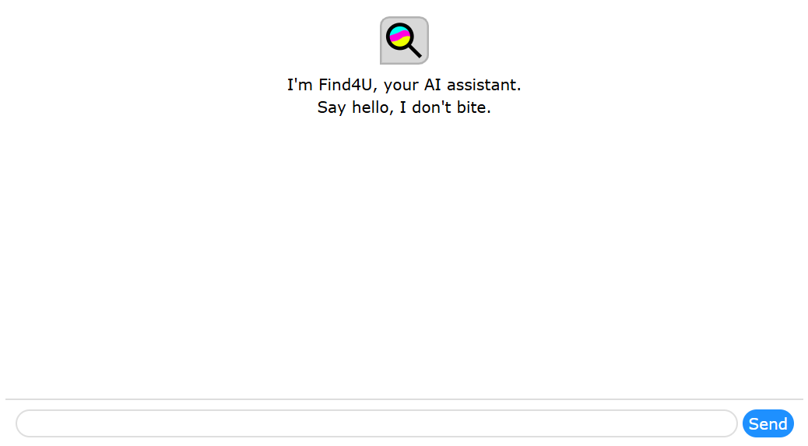

# Using Find4U

For an overview, see [the introduction](index.md). This document assumes you know about UI elements such as inputs and buttons.

The above is a screenshot of Find4U's interface. If you're familiar with AI chat apps like ChatGPT, Gemini, Claude, Grok, Meta AI, Snapchat's My AI, Microsoft Copilot, or Microsoft 365 Copilot, you already know how to use Find4U. Type your inquiry in the input field and press the "Send" button and Find4U will try it's best to find you an answer that is mostly non-hallucinated.